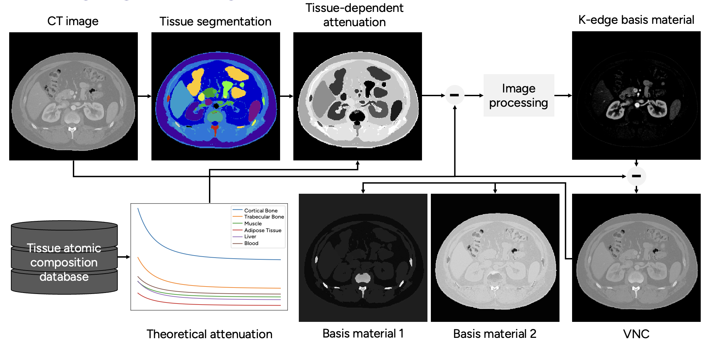

# Spectral Phantom Generator – convert SECT/EICT images to spectral CT phantoms

The Spectral Phantom Generator (SPG) generates spectral CT phantoms from input single energy (conventional) CT images. The generator uses automatic segmentation of the CT image, together with tabulated tissue atomic compositions to generate the spectral component. The overall pipeline of SPG is depicted in the image above.

## How it works
### Segmentation
The first thing that has to be done is the image segmentation. This is done via [segment.py](segment.py). The standard implementation uses [TotalSegmentator](https://github.com/wasserth/TotalSegmentator) but any segmentator can be used with some manual tweaking of the code. Alternatively, you can use an already existing segmentation of the image. If so, continue to the next step.

### Material extraction
After having obtained a segmentation of the image, the next step is to run [material_extractor.py](material_extractor.py). This script uses the image and its segmentation to find the material distributions of your choice within the image. The default implementation extracts iodine, gadolinium, calcium and water distributions, but this may be changed according to your preference. 
There are two types of material extractor classes implemented, namely:
- [Subtraction extractor](material_extractor.py#L26)
- [Change of basis extractor](material_extractor.py#L201)
  
#### Subtraction extractor
The subtraction extractor is meant for contrast-enhanced CT images where one want to extract the material distribution of the contrast agent. 
An example where this could be used is to extract the iodine distribution in a contrast-enhanced image enabling generation of phantoms for K-edge imaging purposes. 
This class subtracts (hence its name) the tabulated attenuation $\mu_{\mathrm{Tissue}}(E_{\mathrm{effective}})$ (calculated without contrast media) at an assumed effective energy $E$ within each organ 

$$\mu_{\mathrm{Contrast}}(x,E_{\mathrm{effective}}) = f(\mu_{\mathrm{CT\~image}}(x) - \mu_{\mathrm{Tissue}}(E_{\mathrm{effective}}))$$

leaving only the attenuation due to contrast. The function $$f$$ denotes smoothing and morphological operations to remove unwanted structures and noise. 

The class can split the subtracted attenuation $\mu_{\mathrm{Contrast}}$ into $i=1,\ldots,C$ different materials (like iodine and gadolinium as per default) by setting

$$\mu_{\mathrm{Contrast_i}}(x, E_{\mathrm{effective}}) := w_i \mu_{\mathrm{Contrast}}(x, E_{\mathrm{effective}})),$$

given a list of fractions $w_i$ for the different materials and for each organ of interest, where $$\sum_{i=1}^{C} w_i = 1$$. This enables e.g. studies where one might have two unique K-edges present. 
The final material distribution is then given by

$$a_{\mathrm{Contrast_i}}(x) := \frac{\mu_{\mathrm{Contrast_i}}(x, E_{\mathrm{effective}})}{\mu_{\mathrm{Contrast_i}}(E_{\mathrm{effective}})}$$

where the numerator is the theoretical attenuation of contrast material $i$ at energy $E_{\mathrm{effective}}$.

Upon removing the attenuation due to contrast, we form the virtual non-contrast (VNC) image $$\mu_{\mathrm{VNC}}(x, E_{\mathrm{effective}}) := \mu_{\mathrm{CT\~image}}(x) - \mu_{\mathrm{Contrast}}(x,E_{\mathrm{effective}})$$ that can be used as input to the [change-of-basis extractor](#change-of-basis-extractor).

#### Change-of-basis extractor
This extractor utilize the tissue attenuation information within each organ $\mu_{\mathrm{Tissue}}(E)$ and projects it onto a user-defined material basis of $M$ materials (water and calcium per default)

$$\mu_{\mathrm{Tissue}}(E) = \sum_{m=1}^M b_m\mu_{m}(E)$$

by solving the above linear system for $N \geq M$ different energies $E$. This class should **only** be used on images without contrast media or on images where contrast media has been virtually removed since $\mu_{\mathrm{Tissue}}$ does not account for the added attenuation due to contrast.

The extracted coefficients $b_m$ within each organ are then weighted pixel-by-pixel so that the projected sum equals the input at each pixel using the weights 

$$w(x) = \dfrac{\mu_{\mathrm{input}}(x)}{\sum_{m=1}^M a_m\mu_{m}(E_{\mathrm{effective}})},$$

yielding the final material distributions as $a_m(x) := b_m w(x)$.

## Disclaimer
The SPG should not be used for clincial use. It is only intended to be used for generating data for research purposes. The resulting phantoms have not been clinicially validated and may not represent real material distributions.
